<div align="center">

<h3><code>ashusingh06@github:~$ whoami</code></h3>

<p>
  <strong>Ashish Singh</strong><br />
  <code>Student • Full Stack Developer • AI Learner</code><br />
  <em>Currently Building Autonomous AI Agents</em>
</p>

<br />

<table border="0">
  <tr>
    <td align="center" valign="middle">
      
    </td>
    <td align="center" valign="middle">
      
    </td>
  </tr>
</table>

<br />

<h3><code>ashusingh06@github:~$ ./contributions --current</code></h3>

<a href="https://github.com/ashusingh06">
  
</a>

<br />
<br />

<h3><code>ashusingh06@github:~$ cat current.txt</code></h3>

<div align="left" style="max-width: 860px;">

```yaml
Building : Autonomous AI Agents
Learning : LLM Architectures • Multi-Agent Orchestration • System Design
Focus    : Autonomous Workflows & Software Engineering Agents
Goal     : Build intelligent software that solves complex real-world problems
```

</div>

<br />

<h3><code>ashusingh06@github:~$ ls -la projects/</code></h3>

| Project | Description | Stack | Status |
| :--- | :--- | :---: | :---: |
| [**AI Agents Engine**](https://github.com/ashusingh06/ai-agents) | Autonomous multi-agent workflow & orchestration framework | `Python` `FastAPI` | `Active` |
| [**Discord Logger**](https://github.com/ashusingh06/DiscordStudyTrackerBot) | Real-time automated activity & security audit logging bot | `TypeScript` `Node.js` | `Active` |
| [**Study Tracker**](https://github.com/ashusingh06/study-tracker) | Student learning analytics & focus time tracking system | `Next.js` `Supabase` | `In Progress` |
| [**Developer Portfolio**](https://github.com/ashusingh06/portfolio) | Minimalist interactive terminal-themed web platform | `Next.js` `TypeScript` | `In Progress` |

<br />

<h3><code>ashusingh06@github:~$ tech_stack</code></h3>

<p>
  <code>Next.js</code> &nbsp; <code>Node.js</code> &nbsp; <code>TypeScript</code> &nbsp; <code>Python</code> &nbsp; <code>Supabase</code> &nbsp; <code>PostgreSQL</code> &nbsp; <code>Git</code>
</p>

<br />

<h3><code>ashusingh06@github:~$ logout</code></h3>

<pre>
Session terminated successfully.
Built with Python • Pure SVG • GitHub Actions
</pre>

<h3><code>ashusingh06@github:~$ </code></h3>

</div>
